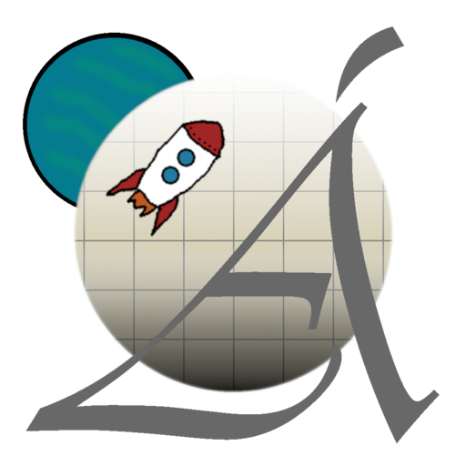

  
# MoSzE - Álomprojekt

A Modern szoftverfejlesztési eszközök (GKNB_INTM006) tantárgy féléves projektfeladatának közös GitHub Repository-ja.

<leírás>
<irányítás>

---

## Telepítés/Futtatás

A program az Editorban futtatható/buildelhető.
A futtatható tesztverzió az 'exe' mappában található .exe kiterjeztésű fájl.

## Assetek

A sprite-ok és a hangeffektek, az alábbi [linken](https://drive.google.com/drive/folders/1DHKS8r9VeH_RksP4r9xgj3aoy9PINb3Z?usp=drive_link) érhetőek el.
A sprite-ok a projekten belül ezen az elérési úton érhetőek el: 'Alomprojekt\Assets\Sprites\Spriteok'.
